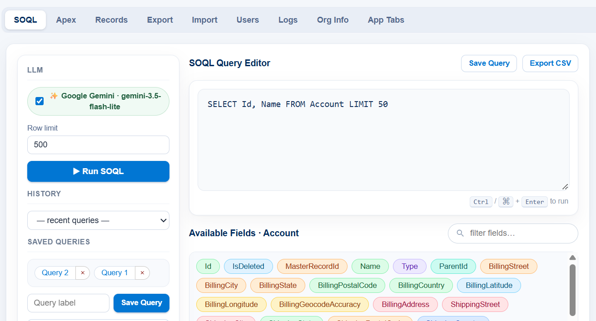
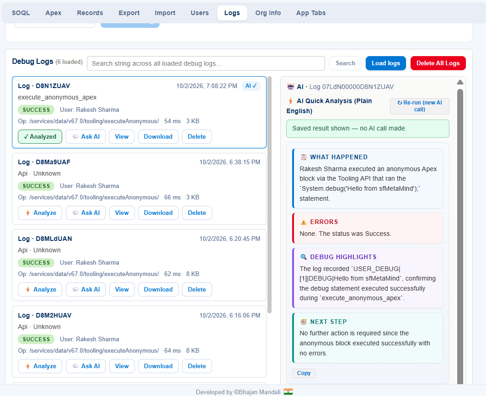
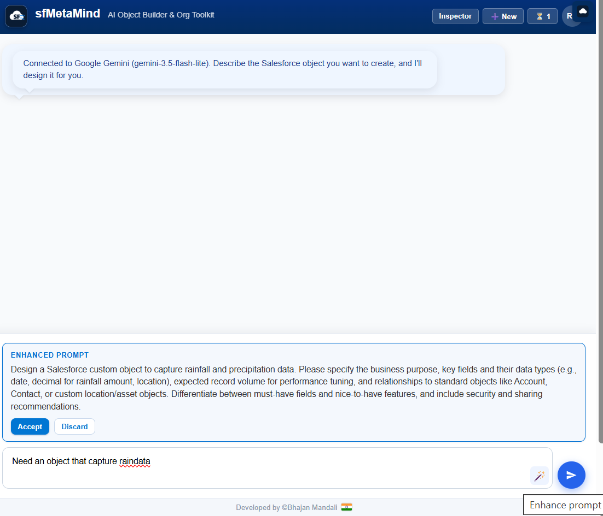

# sfMetaMind - AI Object Builder & Org Toolkit

A Chrome browser extension that uses LLM (Large Language Models) to help you design and create Salesforce custom objects and fields from natural language descriptions.

Session handling builds on ideas from [Salesforce Inspector Reloaded](https://github.com/tprouvot/Salesforce-Inspector-reloaded) (MIT licensed — see `LICENSE` and `THIRD-PARTY-NOTICES.md`). sfMetaMind is an independent project by Bhajan Mandali and is not affiliated with, sponsored, or endorsed by Salesforce, Inc.

## Features

- **Natural Language Object Design**: Describe what data you want to capture in plain English, and the AI proposes a complete Salesforce object with fields
- **Multi-LLM Support**: Works with OpenAI, Anthropic Claude, Google Gemini, and any OpenAI-compatible API (OpenCodeZen, etc.)
- **Interactive Refinement**: Chat with the AI to modify the proposal - add fields, change types, adjust properties
- **Visual Preview**: See the object schema before deploying - labels, API names, types, required flags
- **One-Click Deploy**: Creates the custom object and all fields directly in your Salesforce org via the Tooling API
- **Relationship Fields**: AI suggests Lookup and Master-Detail relationships when appropriate
- **Field Permissions**: Configurable field-level security during deployment
- **AI Query Repair**: SOQL errors are explained and auto-fixed by the LLM with one-click apply
- **AI Log Analysis**: Debug logs get a plain-English verdict plus per-log AI chat
- **Inspector Tools**: SOQL runner, record browser, CSV export/import, user management, debug-log viewer with AI analysis, org info, app-tab assignment

## AI Features

Every AI action uses the same LLM configured on the Options page — your API key stays in
local storage, and only the relevant prompt/log text is sent to the provider you chose.

### Object Builder chat

Describe what you want in plain English and the AI proposes the complete object — labels,
API names, data types, required flags, picklist values, and Lookup/Master-Detail
relationships. Keep chatting to refine it ("add a field for resolution notes", "make
Priority required") and deploy when the visual preview looks right.

**✨ Enhance Prompt** turns a rough one-liner into a structured design brief before you
send it: business purpose, key fields and their data types, expected record volume,
relationships to standard objects, must-have vs. nice-to-have features, and security and
sharing recommendations — with **Accept** / **Discard** controls.



### SOQL editor

A two-column workspace: LLM provider chip, row limit, run button, query history and
saved queries on the left; the query editor, colour-coded field explorer and results
table on the right — no horizontal scrolling.

When Salesforce rejects a query, the extension asks the LLM for a **✨ Suggested fix**:
a plain-English explanation of what went wrong plus the corrected query, with
**Apply & Run** and **Copy** buttons.



### Debug logs

- **⚡ AI Quick Analysis (Plain English)** — a one-click verdict per log rendered as four
  cards: *What happened*, *Errors*, *Debug highlights*, *Next step*. Results are cached
  per log ID, so clicking **Analyzed** again shows the saved result without another AI
  call; **Re-run** forces a fresh call when you want one.
- **💬 Ask AI** — a per-log chat for drilling into any line of the trace.



## Installation

### Prerequisites

- Google Chrome browser (v88 or later)
- Node.js with npm (for React dependencies)
- A Salesforce org where you have System Administrator permissions
- An API key from at least one LLM provider

### Setup

1. **Clone or download this repository**

2. **Install dependencies** (to get React):
   ```bash
   cd sf-object-creator
   npm install
   npm run copy-react
   ```

3. **Load the extension in Chrome**:
   - Open `chrome://extensions/`
   - Enable **Developer mode** (toggle in top right)
   - Click **Load unpacked**
   - Select the `addon` subdirectory of this project

4. **Configure your LLM provider**:
   - Click the extension icon on any Salesforce page
   - Click **Options** (or open `options.html` from the extension)
   - Select your LLM provider (OpenAI, Claude, Gemini, or OpenAI-compatible)
   - Enter your API key
   - Select a model
   - Click **Save Settings** then **Test Connection**

5. **Start creating objects**:
   - Navigate to your Salesforce org
   - Click the extension icon
   - Click **sfMetaMind** sidebar button
   - Describe the object you want to create!

## Usage Examples

### Example 1: Payment Transactions
```
I want an object that captures payment transaction data including amount, status, payment method, and reference numbers
```

**AI Output**: Creates a `Payment_Transaction__c` object with fields:
- Amount (Currency)
- Status (Picklist: Pending, Completed, Failed, Refunded)
- Payment Method (Picklist: Credit Card, Debit Card, Bank Transfer, PayPal, Other)
- Reference Number (Text, External ID)
- Transaction Date (DateTime)

### Example 2: Support Tickets with Relationships
```
Create a customer support ticket object that relates to Accounts and Contacts, with priority levels and assignment tracking
```

**AI Output**: Creates a `Support_Ticket__c` object with Lookup fields to Account and Contact, plus Priority picklist, Status picklist, and assignment fields.

### Example 3: Refinement
After the initial proposal, you can say:
```
Add a field for the resolution notes and make the priority field required
```

The AI will update the proposal accordingly.

## Supported Field Types

| Type | Description |
|------|-------------|
| Text | Short text (up to 255 chars) |
| Text Area | Multi-line text |
| Text Area (Long) | Very long text content |
| Number | Numeric values |
| Currency | Monetary amounts |
| Percent | Percentage values |
| Date | Date only |
| Date/Time | Date and time |
| Checkbox | Boolean true/false |
| Picklist | Single select from values |
| Picklist (Multi-Select) | Multiple select from values |
| Email | Email addresses |
| Phone | Phone numbers |
| URL | Web links |
| Lookup | Relationship to another object |
| Master-Detail | Required relationship to another object |

## LLM Provider Configuration

OpenAI, Anthropic Claude, Google Gemini, and any OpenAI-compatible endpoint
(OpenCodeZen, etc.) are supported. One configuration drives every AI feature —
the object-builder chat, Enhance Prompt, SOQL query repair, and debug-log analysis.

- **API Key**: your provider's key (stored only in your browser's local storage)
- **Base URL**: only needed for OpenAI-compatible endpoints
- **Models**: the Options page always lists the currently supported models

## Architecture

```
sf-object-creator/
├── addon/
│   ├── manifest.json          # Chrome Extension Manifest V3
│   ├── background.js          # Service worker (session management)
│   ├── inspector.js           # Salesforce API layer (REST/SOAP)
│   ├── utils.js               # Shared utilities
│   ├── object-creator.html/js # Main feature page (chat + preview)
│   ├── options.html/js        # LLM provider settings
│   ├── llm/
│   │   ├── llm-service.js     # Provider abstraction + config
│   │   ├── openai.js          # OpenAI adapter
│   │   ├── claude.js          # Anthropic Claude adapter
│   │   ├── gemini.js          # Google Gemini adapter
│   │   └── openai-compatible.js
│   ├── prompts/
│   │   └── system-prompt.js   # AI prompt engineering
│   ├── button.js/css          # Content script (injected into SF pages)
│   └── styles/slds/           # Salesforce Lightning Design System CSS
└── package.json
```

## Security

- API keys are stored locally in your browser (`localStorage`) and never sent anywhere except the LLM provider you configured
- The extension communicates directly with Salesforce APIs using your existing session
- Only your natural language descriptions are sent to LLM providers - object/field data stays in your org unless you paste it into the chat
- Same authentication model as Salesforce Inspector Reloaded (OAuth2 PKCE + session cookies)

## Permissions

- `cookies`: Read Salesforce session cookies for API authentication
- `storage`: Store LLM configuration and extension settings
- Host permissions for Salesforce domains and LLM API endpoints

## Development

```bash
# Install dependencies
npm install

# Copy React files to addon directory
npm run copy-react

# Load in Chrome
# 1. Open chrome://extensions/
# 2. Enable Developer mode
# 3. Click Load unpacked
# 4. Select the addon/ directory
```

## License

MIT License — see `LICENSE`. Session/auth code derives in part from
Salesforce-Inspector-reloaded (MIT © 2023 Thomas Prouvot); see
`THIRD-PARTY-NOTICES.md` for full attribution.
